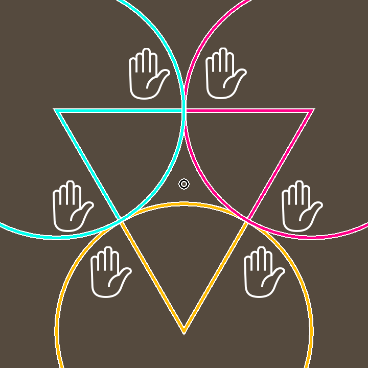

# RPS Showdown

Author: Greg Loose

## Design:

In RPS Showdown, three players each control two hands using a (probably over-designed) control scheme mimicking real movements, with the goal of beating their neighbors at rock-paper-scissors. At every moment in real time, the "score point" moves toward the winning hands, and a player wins if they can bring it all the way to their corner of the triangle.

## Networking:

My code only makes slight modifications to the starter networking code, with the only major difference being the fields maintained in the player and game states. The game now keeps a "bary_score", which is a vec3 representing the players' "score" in barycentric coordinates (explained in "How to Play"). It also keeps a boolean state representing whether the game is over or not, and a floating-point timer which counts the time until the game is restarted after ending. Along with the game state, it sends the state of every player, with the first player in the message being the one controlled by the recipient. Players maintain a set of buttons, as well as their color, identifying index, current stamina, and hand state (an enum, either Rock, Paper, Scissors, or None). All of these fields are just plain old data types, with no need for any fancy string handling or other techniques. It is also worth noting that the server now immediately closes connections beyond the third, as this is a 3-player game.

## Screen Shot:

## How To Play:

### Controls:

a, s, d, f : Press to close the corresponding finger of your left hand

j, k, l, ; : Press to close the corresponding finger of your right hand

### Instructions (IMPORTANT)

* Disclaimer: This is easily the weirdest and most experimental game I've made so far, and it is impossible to playtest on my own; play at your own risk ;)

* Each player sits at one corner of the triangle and controls two hands with four fingers each (the thumbs are unused). With your fingers resting on the home row, you can press down on any finger to close it. The combination of open and closed fingers produces a hand position:
  * All fingers closed: Rock
  * All fingers open: Paper
  * All but index and middle finger closed: Scissors
  * Any other configuration: Invalid (loses to everything)
* At any given moment, your left hand plays against the neighbor on your left, and your right hand plays against the neighbor on your right. For each matchup, the winner's score increases and the loser's score decreases.
* Player scores are translated to barycentric coordinates for the "score point", which starts in the center. In practice, this means that for each neighbor you are beating at any point in time, the score point moves along the line from their corner of the triangle to yours.
* The game ends when the score point leaves the triangle. The winner is the player whose side of the triangle it ends up in.
* To prevent random keyboard mashing, each key press temporarily decreases your stamina, represented by a concentric circle in your region. If it drops below zero, your hand position becomes invalid until it recovers.

Sources: https://fonts.google.com/noto/specimen/Noto+Emoji

This game was built with [NEST](NEST.md).

